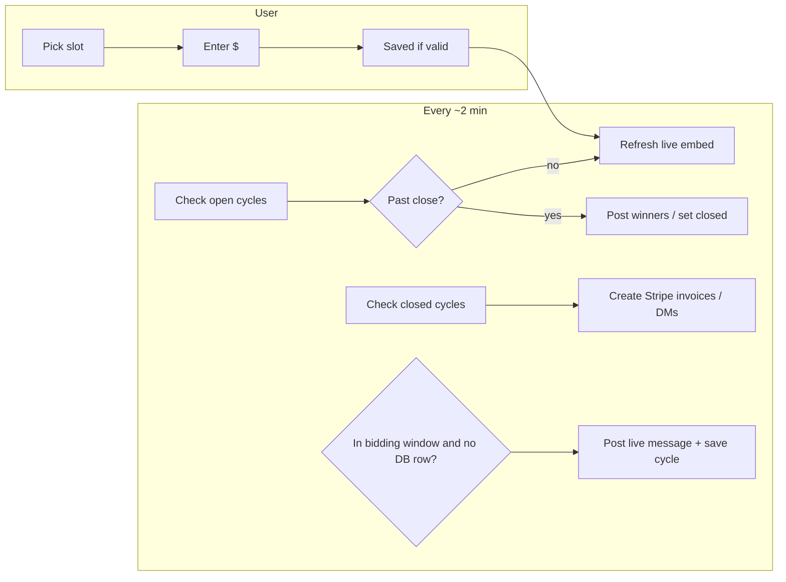

# How bidding works

This bot runs **monthly slot auctions** (10 slots) in Discord. You do **not** start bidding with a command—the bot opens a window on a schedule and posts a message users interact with.

---

## The big picture

1. **On a calendar schedule**, the bot posts a **live bidding message** in your bidding channel.
2. Users pick a **slot (1–10)** and enter a **dollar amount** in a popup.
3. When the window **ends**, the bot posts **winners** for each slot.
4. If Stripe is set up, the bot **sends invoices** (and later marks them paid when Stripe says so).

---

## When does bidding open?

- Everything uses **Chicago time** (`America/Chicago`), including daylight saving.
- Bidding is for an **upcoming calendar month** (the “target month”).
- **Opens:** **14 days before** the first day of that target month, at the hour set in config (`OPENS_HOUR_CHICAGO`).
- **Closes:** **24 hours before** the target month starts (midnight at the start of the target month, minus 24 hours).

Example: for **April** slots, bidding opens on **March 18** at your configured hour and closes at **March 31, 00:00 Chicago** (24 hours before April 1).

The bot checks this schedule about **every 2 minutes**. If the current time falls inside the open window and there is **no cycle yet** for that target month in the database, it **creates one**: it sends the live embed and saves the cycle.

**Important:** If `Bidding.CHANNEL_ID` is `0` in config, the bot **will not** start new cycles (it only manages cycles that already exist).

---

## What users see while bidding is open

- One **live message** lists **Slot 1** through **Slot 10** and the **current high bid** for each (or $0.00 if none).
- A **dropdown** lets users choose a slot, then a **modal** asks for an amount in USD.
- Rules enforced by the bot:
  - User must be in the **correct Discord server**.
  - If you set a **bidder role**, only members with that role can bid.
  - Amount must be at least **MIN_BID_CENTS** (shown as dollars in messages).
  - Each new bid on a slot must be **higher** than the current high for that slot.

**Who wins a slot?** The **highest** bid. If two bids tie on amount, the **earlier** bid wins.

The live message **updates** when someone bids and also on the regular scheduler tick.

---

## When bidding closes

When **close time** passes (again checked about every 2 minutes):

1. The cycle is marked **closed**.
2. The bot posts a **new message** listing **winners**: each slot shows `@user` and `$amount`, or “no bids” if empty.

Staff can also run **`/force_close_bidding`** to close the current open cycle early (same winner post).

---

## After close: invoices and payment

For **closed** cycles, the scheduler tries to **invoice** winners:

- If **Stripe is not configured**, it skips real invoices and marks the cycle done on its side.
- If Stripe **is** configured, it creates an invoice per winning slot, saves a record, and tries to **DM** the winner a payment link. If DMs fail, it can notify a **staff fallback channel** (if you set one).

Another task polls Stripe about every **2 minutes** and marks invoices **paid** when Stripe reports payment. Optional: log paid events to an invoice log channel.

---

## Cycle states (simple)

| State     | Meaning |
|-----------|---------|
| **open**  | Bidding is active for that target month; the live message is the source of truth. |
| **closed**| Winners are posted; the bot is creating or retrying invoices. |
| **invoiced** | The invoicing step finished (or was skipped). Individual invoices can still go from pending → paid via Stripe. |

---

## Staff commands (optional)

- **`/refresh_bidding_embed`** — Refreshes the live embed for the current open cycle.
- **`/sync_bidding_views`** — Re-registers the dropdown UI (useful after restarts if interactions break).
- **`/force_close_bidding`** — Closes bidding now and posts winners.

---

## Where this lives in code (for developers)

| Piece | Role |
|-------|------|
| `cogs/events/bidding_scheduler.py` | Timer: open new cycles, refresh embeds, close, invoice. |
| `cogs/functions/bidding_time.py` | Chicago open/close math and “which target month is active now.” |
| `cogs/buttons/bidding/bid_view.py` | Dropdown, modal, bid validation, embed text. |
| `cogs/functions/bidding_db.py` | SQLite: cycles, bids, invoices. |
| `cogs/commands/bidding/admin.py` | Staff slash commands above. |
| `cogs/events/stripe_poll.py` | Marks invoices paid when Stripe says so. |

---

## Diagram (optional)

